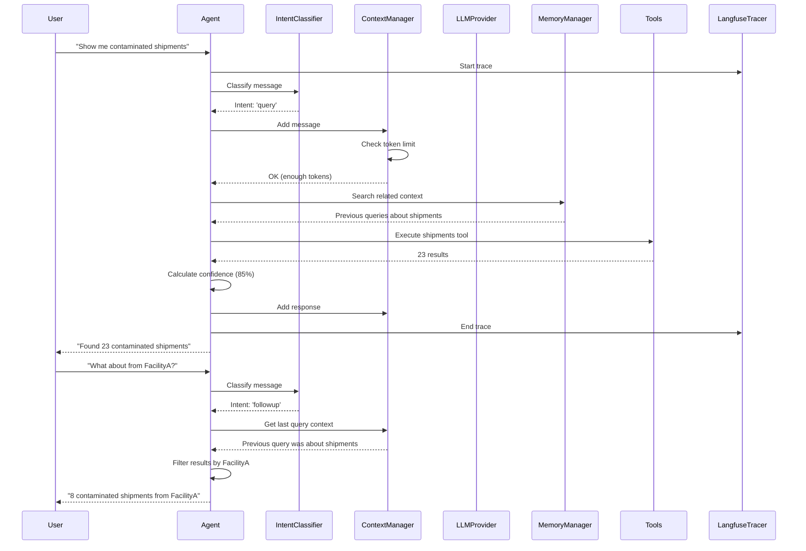

# Architecture

This page explains how Clear AI v2 is structured, how modules work together, and the technical decisions behind the design.

## High-Level Overview

Clear AI v2 follows a **layered architecture** where your agents sit on top of a comprehensive shared library:

```
┌─────────────────────────────────────────────┐
│        Your AI Agents (Future)              │
│   Orchestrator, Planner, Executor, etc.    │
└──────────────────┬──────────────────────────┘
                   │
┌──────────────────┴──────────────────────────┐
│      Clear AI v2 Shared Library             │
│         (19 Production-Ready Modules)        │
├──────────────────────────────────────────────┤
│  Conversational │ Context & │ Workflows     │
│  Intelligence   │  Memory   │               │
├─────────────────┼───────────┼───────────────┤
│  Infrastructure │ Foundation│ Tools & API   │
│  (LLM, Tokens,  │ (Types,   │ (MCP Tools,   │
│   Observability)│  Utils)   │  REST API)    │
└──────────────────┴───────────┴───────────────┘
                   │
┌──────────────────┴──────────────────────────┐
│          External Services                  │
│  • OpenAI / Groq / Ollama (LLMs)           │
│  • Neo4j (Graph DB for memory)              │
│  • Pinecone (Vector DB for memory)          │
│  • MongoDB (Document storage)               │
│  • Langfuse (Observability platform)        │
└─────────────────────────────────────────────┘
```

## Module Organization

The shared library is organized into **5 categories** with **19 modules**:

### 1. Conversational Intelligence (5 modules)

Enables natural, multi-turn conversations with users.

```
conversational/
├── response/          # ResponseBuilder - structured responses
├── intent/            # IntentClassifier - detect user intent
├── confidence/        # ConfidenceScorer - uncertainty quantification
├── progress/          # ProgressTracker - multi-step task tracking
└── conversation/      # ConversationUtils - entity extraction, helpers
```

**Purpose**: Allow AI to ask questions, show progress, express uncertainty, understand follow-ups.

**Key Features**:
- 4 response types (answer, question, progress, acknowledgment)
- 5 intent types (query, question, clarification, confirmation, follow-up)
- Confidence calculation and uncertainty thresholds
- Time estimation for long-running tasks

### 2. Context & Memory (3 modules)

Manage conversation context and persistent memory.

```
context/
├── manager.ts              # ContextManager - main interface
├── message.ts              # MessageHandler - message operations
├── state/                  # StateManager - conversation phases
└── compression/            # Smart compression strategies
    ├── compressor.ts       # ContextCompressor - orchestration
    ├── prioritizer.ts      # MessagePrioritizer - importance scoring
    ├── entity-extractor.ts # EntityExtractor - find key entities
    └── summarizer.ts       # MessageSummarizer - LLM-based compression

memory/
├── manager.ts          # MemoryManager - orchestrates both systems
├── neo4j.ts            # Neo4jMemory - episodic (conversation flow)
├── pinecone.ts         # PineconeMemory - semantic (searchable facts)
└── embeddings.ts       # EmbeddingService - Ollama & OpenAI adapters
```

**Purpose**: Handle long conversations efficiently, remember past interactions.

**Key Features**:
- 3 compression strategies (sliding window, prioritization, summarization)
- Automatic compression when token limit approached
- Episodic memory for conversation flow (Neo4j graph)
- Semantic memory for knowledge retrieval (Pinecone vectors)
- Entity extraction and preservation during compression

### 3. Workflows (2 modules)

Build complex, multi-step processes with conditional logic.

```
workflow/
├── graph/
│   └── builder.ts      # GraphBuilder - fluent API for graphs
├── execution/
│   └── executor.ts     # WorkflowExecutor - run graphs
└── checkpoint/
    └── manager.ts      # CheckpointManager - save/resume state
```

**Purpose**: Define and execute complex business logic as state machines.

**Key Features**:
- LangGraph-style state graphs
- Conditional branching based on state
- Checkpointing for resumable workflows
- Execution metadata (time, steps, status)

### 4. Infrastructure (4 modules)

Core infrastructure for production AI systems.

```
tokens/
├── counter.ts          # TokenCounter - accurate counting (tiktoken)
└── budget.ts           # TokenBudget - budget enforcement

llm/
├── provider.ts         # LLMProvider - unified interface
└── adapters/
    ├── openai.ts       # OpenAI adapter
    ├── groq.ts         # Groq adapter
    └── ollama.ts       # Ollama adapter

config/
└── loader.ts           # loadConfig - environment management

observability/
└── langfuse.ts         # LangfuseTracer - production tracing
```

**Purpose**: Provide reliable, cost-controlled, observable AI infrastructure.

**Key Features**:
- Multi-model token counting (GPT, Claude, Llama, etc.)
- Per-operation token budgets with enforcement
- Cost estimation before execution
- Automatic fallback between providers
- Distributed tracing with Langfuse

### 5. Foundation (5 modules)

Fundamental building blocks used by all other modules.

```
types/              # TypeScript interfaces for everything
validation/         # Zod schemas for runtime validation
utils/              # 10+ utility modules
    ├── template.ts     # Parameter interpolation
    ├── statistics.ts   # Statistical functions
    ├── retry.ts        # Exponential backoff
    ├── circuit-breaker.ts  # Failure protection
    ├── logger.ts       # Structured logging
    └── ...
tools/              # MCP tools (Shipments, Facilities, etc.)
api/                # REST API with MongoDB
```

**Purpose**: Provide common functionality and domain-specific tools.

**Key Features**:
- Strict TypeScript types for everything
- Runtime validation with Zod
- Circuit breaker pattern for resilience
- MCP-compliant tool implementations
- RESTful API for waste management domain

## Data Flow

Here's how data flows through a typical conversation:



## Key Design Decisions

### 1. TypeScript-First

**Decision**: Use strict TypeScript with ES modules

**Rationale**:
- Catch errors at compile time, not runtime
- Better IDE support and autocomplete
- Self-documenting code with types
- Modern module system (ES modules)

**Trade-off**: Slightly more verbose, requires compilation step

### 2. Dependency Injection

**Decision**: Support constructor injection for testing

**Rationale**:
- Enable unit testing without real services
- Swap implementations easily (e.g., OpenAI ↔ Ollama)
- Better modularity

**Example**:
```typescript
// Production: real services
const memory = new MemoryManager();

// Testing: mocked services
const memory = new MemoryManager({
  mockNeo4j: mockDriver,
  mockPinecone: mockClient
});
```

### 3. Test-Driven Development

**Decision**: Write tests before implementation (TDD)

**Rationale**:
- Ensure all code is testable
- Document expected behavior
- Catch regressions early
- Build confidence in changes

**Result**: 724 unit tests + 45 integration tests = 100% pass rate

### 4. Modular Architecture

**Decision**: Small, focused modules with single responsibilities

**Rationale**:
- Easy to understand and maintain
- Use only what you need
- Clear separation of concerns
- Simpler testing

**Metric**: Average 110 lines of code per file

### 5. Multi-Provider Support

**Decision**: Abstract LLM providers behind unified interface

**Rationale**:
- Avoid vendor lock-in
- Provide reliability through fallback
- Enable cost optimization
- Support local/private deployments

**Trade-off**: Slightly more complex setup

### 6. Configurable Embeddings

**Decision**: Support multiple embedding providers (Ollama, OpenAI)

**Rationale**:
- Privacy: Use local Ollama for sensitive data
- Cost: Ollama is free, OpenAI costs per request
- Flexibility: Switch based on needs

**Default**: Ollama (privacy-focused, free)

### 7. Langfuse Integration

**Decision**: Built-in observability with Langfuse

**Rationale**:
- Essential for production debugging
- See exact prompts and responses
- Track costs and performance
- Industry standard for LLM observability

**Trade-off**: Optional dependency

## Technology Stack

### Core Technologies

- **TypeScript 5.x**: Language with strict typing
- **Node.js 22+**: Runtime environment
- **Yarn Berry 4.x**: Package manager with PnP
- **Jest 30.x**: Testing framework
- **Zod 4.x**: Schema validation

### AI & LLM

- **OpenAI SDK**: GPT-3.5, GPT-4 models
- **Groq SDK**: Fast Llama and Mixtral models
- **Ollama**: Local model inference
- **tiktoken**: Accurate token counting
- **Langfuse**: LLM observability

### Databases

- **Neo4j 6.x**: Graph database for episodic memory
- **Pinecone 6.x**: Vector database for semantic memory
- **MongoDB 8.x**: Document database for tools/API

### Infrastructure

- **Express 4.x**: REST API framework
- **Axios 1.x**: HTTP client
- **dotenv**: Environment configuration

## Performance Considerations

### Token Efficiency

**Challenge**: Long conversations consume many tokens, increasing costs.

**Solution**:
- Context compression (saves 70-80% of tokens)
- Sliding window strategy for simple cases
- Intelligent summarization for complex conversations
- Token budgets to prevent overruns

### Memory Efficiency

**Challenge**: Neo4j and Pinecone queries can be slow.

**Solution**:
- Lazy loading (only query when needed)
- Caching recent results
- Batch operations where possible
- Make memory systems optional (disable if not needed)

### Latency Optimization

**Challenge**: Multiple service calls add latency.

**Solution**:
- Parallel execution where possible
- Streaming responses for LLM calls
- Progress updates during long operations
- Conditional logic to skip unnecessary steps

## Security Considerations

### API Keys

- Stored in `.env` file (never committed)
- Validated on startup
- Rotatable without code changes

### Data Privacy

- Support for local Ollama (no data leaves your machine)
- Optional memory systems (disable for sensitive data)
- No logging of user data by default

### Input Validation

- Zod schemas validate all inputs
- Type checking at compile and runtime
- Sanitization of user inputs

## Scalability

The architecture supports scaling in multiple ways:

### Horizontal Scaling

- **Stateless design**: No server-side session state
- **Database-backed memory**: Multiple instances share Neo4j/Pinecone
- **Load balancing**: Distribute requests across instances

### Vertical Scaling

- **Efficient token usage**: Context compression reduces memory needs
- **Lazy loading**: Only load what's needed
- **Streaming**: Process large responses incrementally

### Cost Scaling

- **Token budgets**: Prevent runaway costs
- **Provider fallback**: Use cheaper providers when appropriate
- **Local models**: Zero marginal cost with Ollama

## Testing Strategy

### Unit Tests (724 tests)

- Test each module in isolation
- Mock external dependencies
- Fast execution (less than 3 seconds)
- Run on every change

### Integration Tests (45 tests)

- Test with real services (OpenAI, Neo4j, etc.)
- Verify end-to-end flows
- Slower execution (~5 seconds)
- Run before releases

### Test Coverage

- 100% pass rate maintained
- Every module fully tested
- TDD approach throughout
- Continuous integration ready

## What's Next?

Now that you understand the architecture:

- 💬 [**Conversational AI Modules**](./conversational/response-system.md)
- 🧠 [**Context & Memory Modules**](./context-memory/context-management.md)
- 🔄 [**Workflow Modules**](./workflows/workflow-graphs.md)
- 🏗️ [**Infrastructure Modules**](./infrastructure/token-management.md)
- 🔧 [**Foundation Modules**](./foundation/types.md)

---

**Questions about architecture?** Check the [Development Guide](./guides/development.md) or specific module docs.

